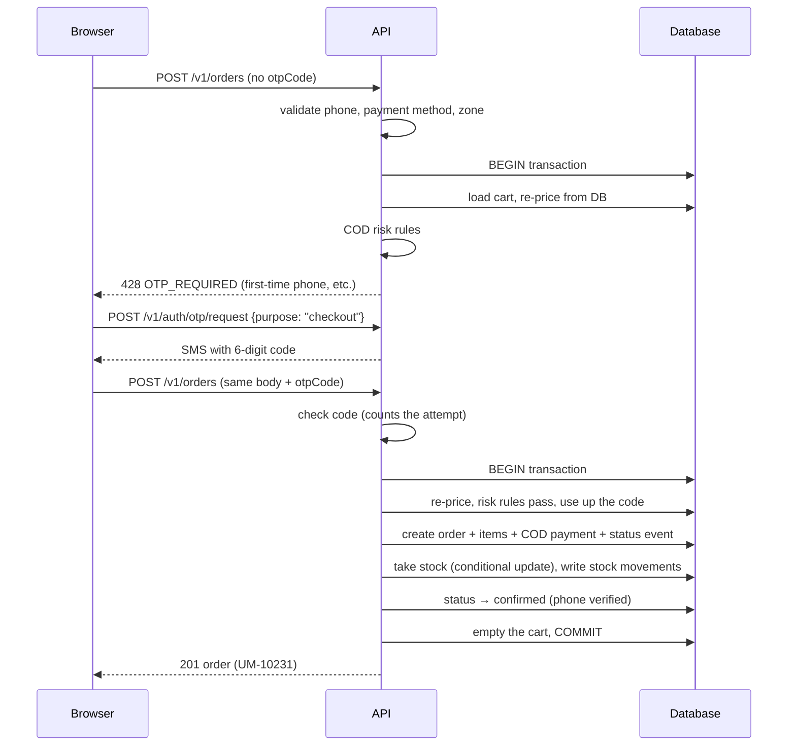
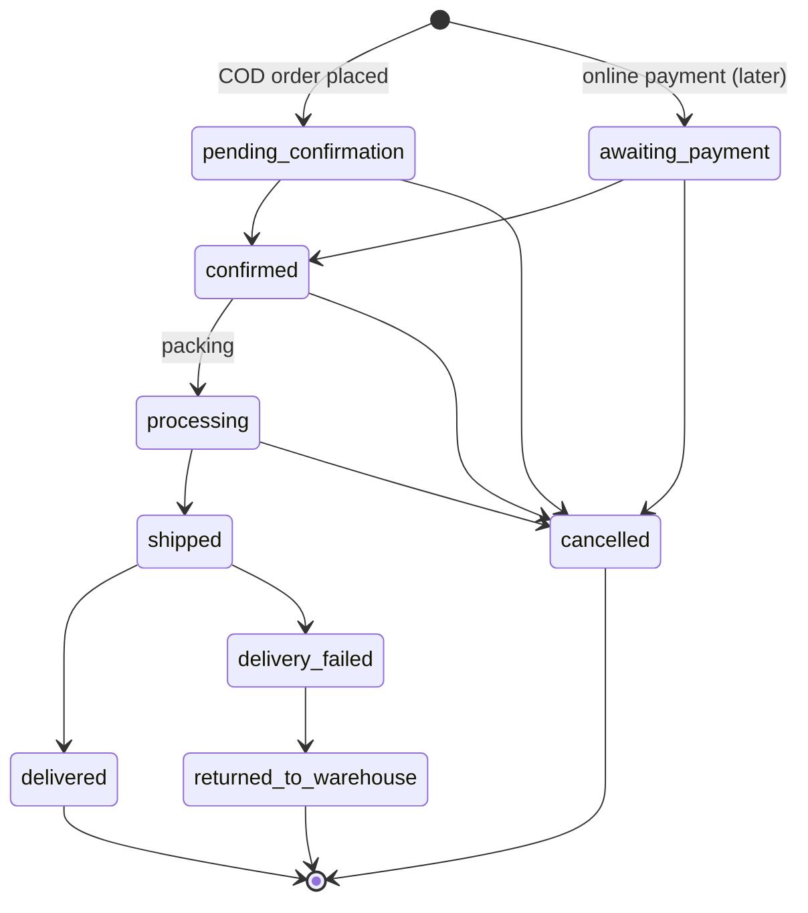

# How the UNA Mart backend works

This document explains how the API is put together and what happens, step by
step, when a customer or an admin uses the shop. Read it before changing the
code. For setup commands and the endpoint list, see `README.md`. For the
product rules (entities, lifecycles), see `SYSTEM_DESIGN.md` in the frontend
repo.

---

## 1. The big picture

```
Browser (storefront / admin)  ──HTTPS + cookies──►  NestJS API (/v1)  ──►  PostgreSQL
Next.js server (page render)  ──────────────────►        │
                                                          └──► SMS sender (console in dev)
```

- **NestJS 12** (TypeScript, ESM) serves a JSON API under `/v1`. Only
  `/health` lives outside `/v1`.
- **Prisma 7** talks to **PostgreSQL 17**. Locally, Postgres runs in Docker
  on port `55432`.
- The **browser calls the API directly** and sends two cookies: `una_cart`
  (guest cart) and `una_session` (login). The Next.js server also calls the
  API to render catalog pages. It needs no cookies for that.
- **Money is always integer poisha** (৳1 = 100 poisha). The API never uses
  decimals for money.
- **Phones are stored as E.164** (`+8801712345678`). Any input such as
  `01712345678` is normalised by `src/common/phone.ts`.

---

## 2. Folder map

```
src/
├── main.ts                 starts the server (PORT, default 4000)
├── app.module.ts           wires every module together + global guards
├── app.setup.ts            /v1 prefix, cookies, error format, validation, CORS, Swagger
├── config/env.ts           reads and checks .env at startup (fails fast)
├── prisma/                 PrismaService — the one database client
├── common/                 error helper (AppError), error filter, phone normaliser,
│                           pagination helper, variant label
├── health/                 GET /health
├── notifications/          SmsSender (ConsoleSmsSender prints codes to the log)
├── auth/                   OTP codes, sessions, SessionGuard, @Auth / @AdminOnly
├── catalog/                categories + products (read only, public)
├── inventory/              the ONLY code that changes stock
├── shipping/               delivery zones + delivery-fee rule
├── cart/                   guest and user carts
├── orders/                 checkout, COD risk rules, lookup, cancel, status changes
└── admin/                  admin API + audit log
prisma/
├── schema.prisma           all tables
├── migrations/             SQL migrations (applied in order)
├── seed.ts, seed-data.json catalog + delivery zones for local/dev
scripts/create-admin.ts     command-line tool to create an admin
test/                       end-to-end tests (real database)
```

Each folder under `src/` is one NestJS **module**: a controller (HTTP routes),
a service (business logic) and DTOs (request/response shapes with
validation).

---

## 3. What happens on every request

1. **Rate limit** (`ThrottlerGuard`, global). Default: 300 requests per minute
   per IP. Sensitive routes have tighter limits (see section 10).
2. **SessionGuard** (global, `src/auth/session.guard.ts`):
   - For a write request (POST/PATCH/DELETE) that carries cookies, it checks
     the `Origin` header. A browser on a site not listed in `WEB_ORIGIN` gets
     `403 BAD_ORIGIN`. This is CSRF protection on top of `SameSite=Lax`
     cookies.
   - It reads the `una_session` cookie, hashes it and looks it up in the
     `session` table. If valid, the user is attached to the request
     (`req.auth`).
   - Routes marked `@Auth()` need a logged-in user (`401` otherwise).
     Routes marked `@AdminOnly()` need role `admin` **and** a session that
     came from the admin login (`403` otherwise).
3. **Validation** (`ValidationPipe`). The body and query are checked against
   the DTO class. Unknown fields are rejected, and types are converted
   (e.g. `"2"` → `2`). Failures return `400 VALIDATION_FAILED`.
4. **Controller → service → Prisma.** Business rules live in services, never
   in controllers.
5. **Errors** leave through `HttpExceptionFilter` in one shape:

   ```json
   { "statusCode": 409, "code": "OUT_OF_STOCK", "message": "Only 1 left of Power Bank." }
   ```

   `code` is stable, so the frontend reacts to it. `message` is shown to
   people. Unexpected crashes become `500 INTERNAL_ERROR` without leaking
   details. The real error goes to the server log.

---

## 4. Data model (main tables)

| Area | Tables | Notes |
|---|---|---|
| Identity | `user`, `session`, `otp_code` | role `customer` / `admin` / `seller`; session `scope` `customer` / `admin` |
| Catalog | `category`, `product`, `product_variant`, `product_image` | **price and stock live on the variant**; product `status` draft / active / archived |
| Stock | `stock_movement` | append-only ledger: every +/- with a reason (order, cancel, return, restock, adjustment) |
| Delivery | `delivery_zone` | `inside_dhaka`, `outside_dhaka`; fee in poisha |
| Shopping | `cart`, `cart_item` | a cart belongs to a guest token **or** a user |
| Orders | `order`, `order_item`, `order_status_event`, `payment` | items are snapshots (name, price, SKU at purchase time) |
| Trust | `phone_flag`, `audit_log` | COD refusal counts, blocked phones; every admin change |

Rules that keep data correct:

- **Archive, don't delete.** Products are archived and categories are hidden.
  Old orders keep working.
- **Snapshots.** Editing a product never changes a past order.
- **Order numbers** come from a Postgres sequence: `UM-10231`, `UM-10232`, …

---

## 5. Catalog (public, read only)

- `GET /v1/categories` returns active categories as a tree.
- `GET /v1/products` returns a page of products. Each product is priced by its
  **cheapest active variant**, and filters and sorting use that price.
  Filters: `category` (one or several slugs, subcategories included), `q`
  (every word must match name, description or category), `ids`,
  `price_min` / `price_max` (poisha), `rating_min`, `in_stock`, `on_sale`,
  `sort`, `page`, `pageSize`.
- `GET /v1/products/:slug` returns the detail with all active variants,
  images and the category path (e.g. Fashion → Men's Wear → Winter).
- Draft and archived products are never returned to the public.

Search uses `ILIKE` backed by `pg_trgm` trigram indexes. These are created in
the first migration.

---

## 6. Cart

- **Guest:** the first "add to cart" creates a cart and sets the
  `una_cart` cookie (random 32-byte token, httpOnly, 30 days). Only looking
  at the cart never creates one.
- **Logged in:** the cart belongs to the user. No cart cookie is needed.
- **At login** the guest cart is merged into the user's cart (quantities
  added, capped at stock) and the cookie is cleared.
- Quantities are capped at stock and at 50 per line.
- The cart response always carries **current** prices, images and stock. A
  line that became unavailable or exceeds stock gets an `issue` flag and is
  left out of the subtotal. It is never silently removed.

---

## 7. Checkout (COD) — step by step

`POST /v1/orders` with name, phone, optional email, address
(`line1`, `area?`, `city`), delivery zone, `paymentMethod: "cod"`, optional
note and optional `otpCode`.



In detail:

1. **Basic checks.** The phone must be a Bangladeshi mobile number
   (`INVALID_PHONE`). Only `cod` is accepted; bKash, Nagad and card return
   `PAYMENT_METHOD_UNAVAILABLE`. The zone must exist and be active.
2. **Code check (only if `otpCode` was sent).** This happens *before* the
   transaction, so a wrong guess is always counted, even though the order
   then fails.
3. **One database transaction** does everything else. Any error rolls back
   all of it:
   - Load the cart and **re-price every line from the database**. The client
     never sends prices.
   - Reject items that are no longer active (`ITEM_UNAVAILABLE`).
   - Compute subtotal + delivery fee. The fee is waived when every item has
     free delivery.
   - Optional hard cap: `COD_MAX_ORDER_TOTAL` (`COD_LIMIT_EXCEEDED`).
   - **COD risk rules** (`src/orders/cod-risk.ts`):
     - blocked phone → `422 COD_BLOCKED`;
     - first-time phone (no earlier verified or delivered order) → code needed;
     - 2 or more refused COD deliveries → code needed;
     - total above `COD_OTP_THRESHOLD` (default ৳10,000) → code needed.

     A logged-in customer ordering to their own verified phone never needs a
     code. If a code is needed and missing, the result is
     `428 OTP_REQUIRED`.
   - Create the order (`pending_confirmation`), item snapshots, the first
     status event and a COD `payment` row (`pending`).
   - **Take stock** through `InventoryService.decrement`, which runs
     `UPDATE … SET stock = stock - n WHERE stock >= n`. If two shoppers race
     for the last unit, one update succeeds and the other changes 0 rows and
     fails with `409 OUT_OF_STOCK`. No overselling is possible.
   - If the phone was verified (code or login), move the order to
     `confirmed` automatically. Otherwise the team confirms it by phone call.
   - Empty the cart.
4. Return the order. (Order SMS is a TODO until an SMS gateway exists.)

---

## 8. Order lifecycle



- **Only `OrdersService.transition()` changes a status.** It rejects moves
  not in the table above (`INVALID_TRANSITION`) and detects two people
  changing the same order at once (`CONCURRENT_UPDATE`). It also writes an
  `order_status_event` (who, when, note).
- **Side effects inside `transition()`:**
  - `cancelled` → stock goes back (`stock_movement` reason `cancel`), and
    pending payments are cancelled.
  - `returned_to_warehouse` → stock goes back (reason `return`).
  - `delivered` (COD) → payment `succeeded`, order `paymentStatus = paid`,
    phone flag `codDeliveredCount + 1`.
  - `delivery_failed` (COD) → phone flag `codRefusedCount + 1`. This feeds
    the "2 refusals → code" rule.
- **Customers may cancel** only while `pending_confirmation`,
  `awaiting_payment` or `confirmed`.

---

## 9. Login and sessions

### Customer login (phone + code)

1. `POST /v1/auth/otp/request { phone, purpose: "login" }`
   - Makes a 6-digit code and stores only an **HMAC hash** of it (keyed with
     `OTP_SECRET`, bound to phone + purpose).
   - The code expires in 5 minutes and allows 5 wrong tries. A phone gets at
     most 3 codes per 15 minutes (`OTP_RATE_LIMITED`).
   - A new code makes older unused codes for the same phone and purpose
     stop working.
   - The code is sent through `SmsSender`. In development it is printed to
     the API log, and the response also contains `devCode`.
2. `POST /v1/auth/otp/verify { phone, code }`
   - Checks the code, marks it used (a code works once), and creates the user
     on first login.
   - Starts a session: a random token goes into the `una_session` cookie
     (httpOnly, `SameSite=Lax`, `Secure` in production, 30 days). The
     database stores only the token's SHA-256.
   - Merges the guest cart.
3. `GET /v1/auth/me`, `PATCH /v1/auth/me` (name, email), `POST /v1/auth/logout`
   (deletes the session row).

### Admin login (password + code)

1. `POST /v1/auth/admin/login { phone, password }` checks the argon2 password
   hash. A wrong phone and a wrong password give the same
   `401 INVALID_CREDENTIALS` and take the same time (no account probing).
   Then an `admin_login` code is sent.
2. `POST /v1/auth/admin/verify { phone, code }` starts a 12-hour session with
   **scope `admin`**.
3. Admin routes require role `admin` **and** scope `admin`. Logging in through
   the customer code login, even with an admin's phone, does not open the
   admin API.

Admins are created with `npm run admin:create -- --phone … --name "…"`. Running
it again for the same phone resets the password and ends their sessions.

---

## 10. Rate limits

| Route | Limit (per IP) |
|---|---|
| everything | 300 / min |
| `POST /v1/orders` | 10 / min |
| `GET /v1/orders/:number`, `POST …/cancel` | 20 / min |
| `POST /v1/auth/otp/request`, `POST /v1/auth/admin/login` | 5 / min |
| `POST /v1/auth/otp/verify`, `POST /v1/auth/admin/verify` | 10 / min |
| OTP sends per phone (any IP) | 3 / 15 min |

The limits are in memory for now (one server). With several servers they
should move to Postgres or Redis.

---

## 11. Admin API

All routes are under `/v1/admin/*` and are `@AdminOnly()`. **Every write is
recorded in `audit_log`** in the same transaction as the change (who, what,
before, after).

- **Stats:** today's orders and value (Dhaka time), pending confirmations,
  status counts, low-stock variants (≤ 5).
- **Orders:** list with filters, detail (timeline with names, payments, phone
  flag, `allowedTransitions`), status change, internal note.
- **Products:** list, create (with first variant + opening stock + image
  paths), edit, add variant, edit variant (price, SKU, options, active).
- **Stock:** `POST /admin/variants/:id/stock { delta, reason }` goes through
  `InventoryService.adjust`. Stock never goes below 0, and every change is in
  `stock_movement`. Stock can't be edited by typing a number anywhere else.
- **Categories:** create, rename, move (cycles rejected), hide/show.
- **Delivery zones, phone flags** (block / unblock COD), **audit log**.

---

## 12. Configuration (`.env`)

| Variable | Meaning |
|---|---|
| `DATABASE_URL` | Postgres connection string |
| `PORT` | default 4000 |
| `NODE_ENV` | `development` / `test` / `production` |
| `WEB_ORIGIN` | storefront origin(s), comma-separated — CORS + Origin check |
| `OTP_SECRET` | 32+ random characters, used to hash codes |
| `SMS_PROVIDER` | `console` only for now — **refused in production** |
| `COD_OTP_THRESHOLD` | poisha; above this, COD needs a code (default 1000000 = ৳10,000) |
| `COD_MAX_ORDER_TOTAL` | optional hard cap for COD orders |

`src/config/env.ts` checks all of these at startup. A missing or wrong value
stops the server with a clear message.

---

## 13. Running and testing

```bash
npm run db:up          # Postgres in Docker (Docker Desktop must be running)
npm run db:migrate     # apply migrations
npm run db:seed        # catalog + delivery zones (safe to re-run)
npm run start:dev      # API on http://localhost:4000, Swagger at /docs
```

- `npm test`: unit tests (pure rules: risk rules, lifecycle table, OTP
  hashing, fee rule, …).
- `npm run test:e2e`: end-to-end against the real database. The tests create
  their own products and phones and delete them afterwards.
- `npm run lint`, `npm run build`.

---

## 14. Adding something new — the usual path

1. Change `prisma/schema.prisma`, then create a migration (`npm run db:migrate`).
2. Put the logic in a service. Stock changes go through `InventoryService`.
   Order status changes go through `OrdersService.transition()`.
3. Add a controller route with a DTO (class-validator decorators + Swagger
   `@ApiProperty`).
4. Throw `AppError` helpers (`conflict`, `unprocessable`, …) with a clear
   `code`.
5. Admin writes: call `AuditService.log` inside the same transaction.
6. Add a unit test for pure rules and an e2e test for the endpoint.
7. Update `README.md`, and the "Implemented so far" note in `SYSTEM_DESIGN.md`.

---

## 15. Not built yet

SMS gateway (codes only go to the log), online payment (bKash / Nagad / card
via an aggregator), courier booking and tracking webhooks, Cloudinary image
uploads, saved addresses, returns and refunds, reviews, account wishlist,
scheduled jobs (expire unpaid orders, clean old carts and codes), deployment.
